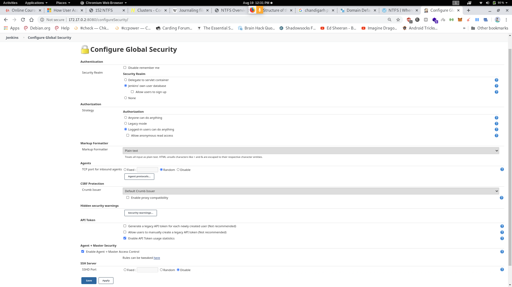
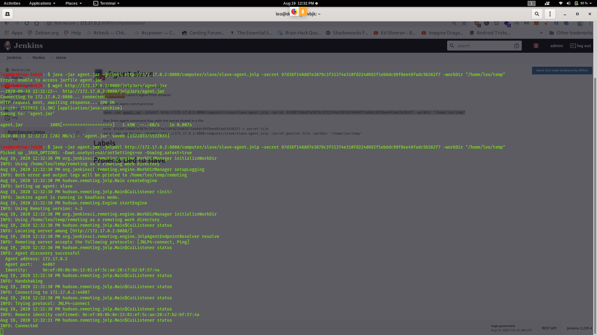
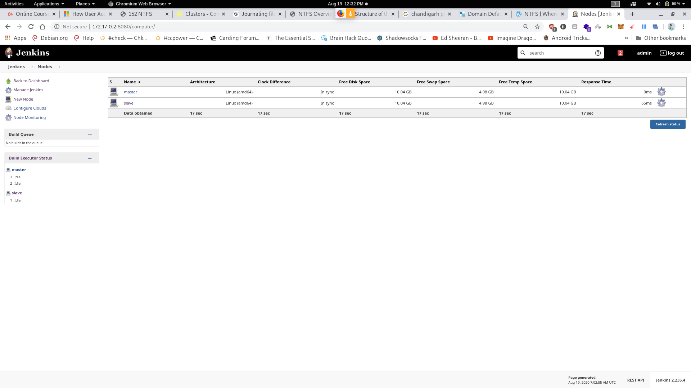
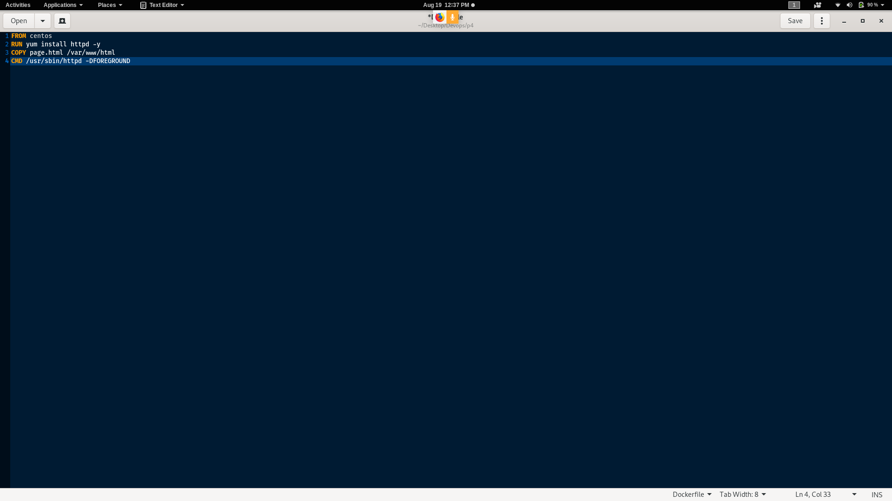
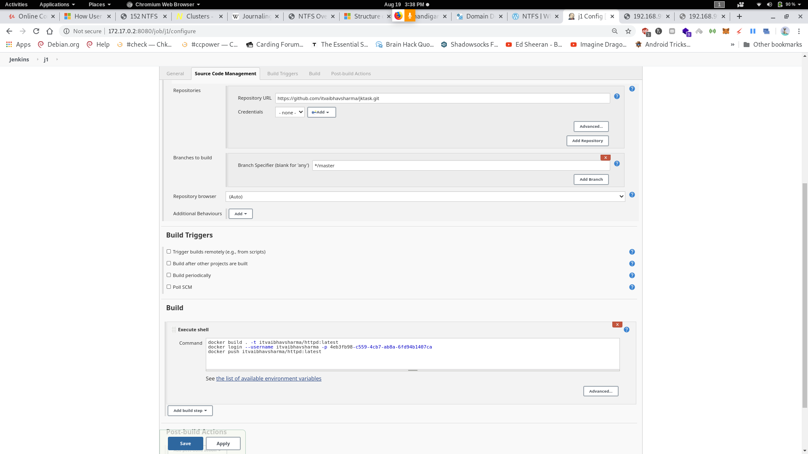
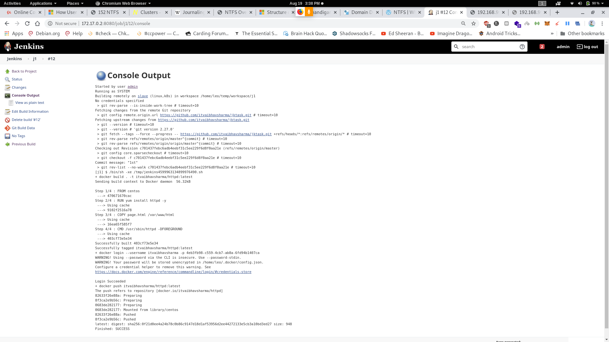
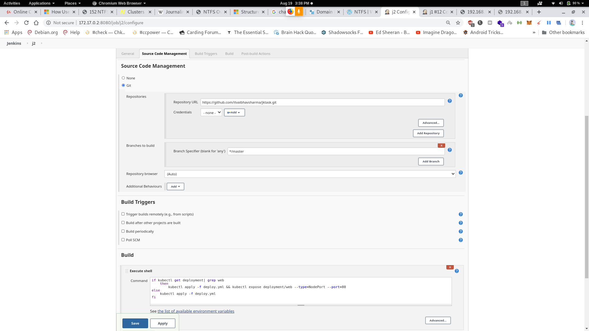
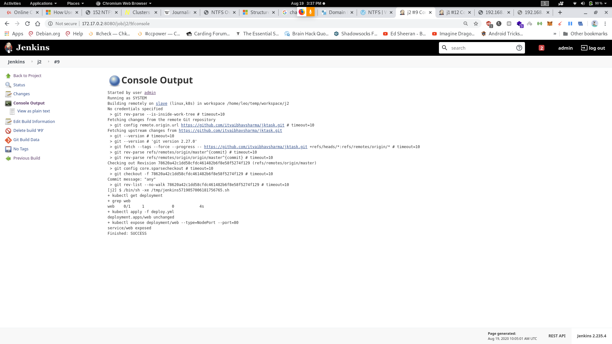
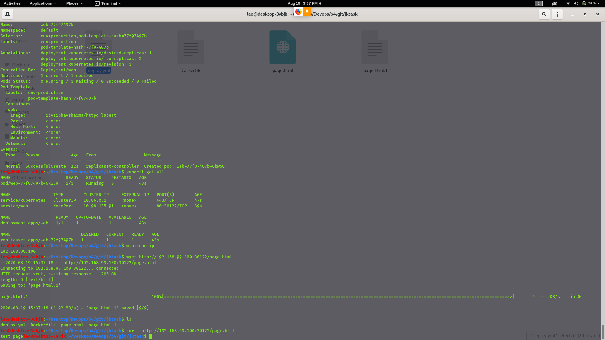

# DevOps4
**Aim**
Create container image that’s has Linux  and other basic configuration required to run Slave for Jenkins. ( example here we require kubectl to be configured )
  When we launch the job it should automatically starts job on slave based on the label provided for dynamic approach.
  Create a job chain of job1 & job2 using build pipeline plugin in Jenkins.
  
**Job1 :**
  
  Pull  the Github repo automatically when some developers push repo to Github and perform the following operations as:
  Create the new image dynamically for the application and copy the application code into that corresponding docker image
  Push that image to the docker hub (Public repository) 
  ( Github code contain the application code and Dockerfile to create a new image ).
  
  **Job2 ( Should be run on the dynamic slave of Jenkins configured with Kubernetes kubectl command):**
  
  Launch the application on the top of Kubernetes cluster performing following operations:
      If launching first time then create a deployment of the pod using the image created in the previous job. Else if deployment already exists then do rollout of the existing pod making zero downtime  for the user.
      If Application created first time, then Expose the application. Else don’t expose it.

**Configuring Master Slave Arch. In jenkins**

**Configure Slave node and connect it**

**Configuring HTTPD Docker File**

***Config Job1***

Build the job

**Configuring Job2**

**Results**

